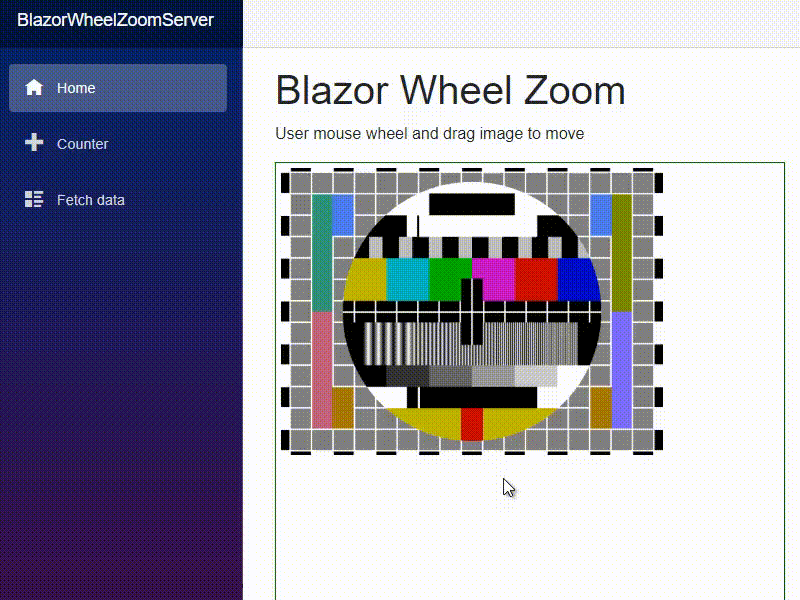

# BlazorWheelZoom
Zoom and move image with Blazor - minimal javascript



**Demo site** http://blazorwheelzoom.m4f.eu/

server side blazor|webassembly blazor
---|---
in Pages/_Host.chtml|in wwwroot/index.html

```HTML
<body>
...
<script src="_content/wheel-zoom-blazor/wheelzoomblazor.js"></script>
</body>
```

for both in _Imports.razor
```
@using BlazorWheelZoomLibrary.Shared
```


**Use the component in your razor page**

```HTML
<WheelZoom Image="/mire.png" width="500" height="500" />
```

If you want a border
```HTML
<div style="border: thin solid green; width: 510px; height: 510px; padding: 5px;">
    <WheelZoom Image="/mire.png" width="500" height="500" />
</div>
```

